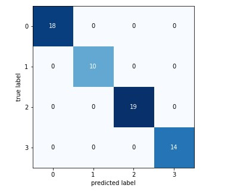
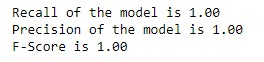

# Bacteria-Classification-at-Genus-level-using-Tensorflow 2.0

### Differentiating between 4 classes of Bacteria - Obtained F score of 100

Dataset from kaggle - https://www.kaggle.com/c/bacteria-classification-at-the-genus-level

#### Confusion Matrix

#### F-Score

#### Final Prediction on the 1227 Test Set images

Submission file is attached above
